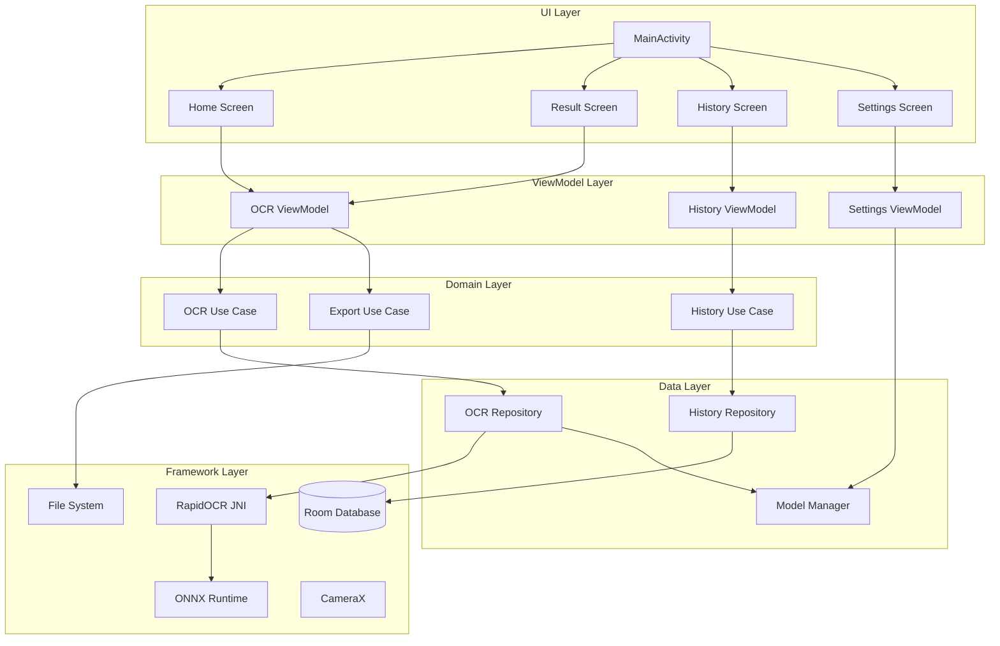

# Android RapidOCR 应用设计

Feature Name: android-rapidocr
Updated: 2026-07-12

## 描述

基于 Android 原生技术栈的离线 OCR 图片文字识别应用。采用 Kotlin + Jetpack Compose 构建 UI，集成 RapidOCR ONNX Runtime 推理引擎，实现拍照/选图后的中英文文字识别、结果展示编辑、文件导出和历史记录管理。

## 架构

### 系统架构图



### 模块划分

```
com.rapidocr.app/
├── ui/                          # UI 层 (Jetpack Compose)
│   ├── theme/                   # Material3 主题
│   ├── home/                    # 首页（拍照/选图入口）
│   ├── result/                  # 识别结果页（编辑/查看/导出）
│   ├── history/                 # 历史记录页
│   ├── settings/                # 设置页（模型切换）
│   └── components/              # 共享 UI 组件
├── viewmodel/                   # ViewModel 层
│   ├── OcrViewModel.kt
│   ├── HistoryViewModel.kt
│   └── SettingsViewModel.kt
├── domain/                      # 领域层
│   ├── usecase/
│   │   ├── RecognizeTextUseCase.kt
│   │   ├── ExportResultUseCase.kt
│   │   └── HistoryUseCase.kt
│   └── model/
│       ├── OcrResult.kt
│       ├── TextBox.kt
│       └── HistoryRecord.kt
├── data/                        # 数据层
│   ├── repository/
│   │   ├── OcrRepository.kt
│   │   └── HistoryRepository.kt
│   ├── local/
│   │   ├── database/
│   │   │   ├── AppDatabase.kt
│   │   │   └── HistoryDao.kt
│   │   ├── entity/
│   │   │   └── HistoryEntity.kt
│   │   └── model/
│   │       └── ModelManager.kt
│   └── ocr/
│       ├── RapidOcrEngine.kt
│       └── OcrConfig.kt
├── di/                          # 依赖注入 (Hilt)
│   └── AppModule.kt
└── MainActivity.kt
```

## 组件和接口

### 1. RapidOcrEngine (OCR 推理引擎)

基于 JNI + C++ 原生库的 RapidOCR 集成。通过 C++ 层调用 ONNX Runtime 进行推理，Kotlin 层通过 JNI 接口封装调用。

```kotlin
class RapidOcrEngine @Inject constructor(
    private val context: Context
) {
    private var nativeHandle: Long = 0

    fun initialize(modelDir: String, config: OcrConfig): Boolean
    fun recognize(bitmap: Bitmap): OcrResult
    fun release()
}
```

**JNI 桥接层 (C++)**:
- 基于 `RapidOcrOnnxJvm` 模块的 C++ 实现
- 封装 ONNX Runtime Session → RapidOCR 推理管线 (Detection → Classification → Recognition)
- CMake 编译产物为 `librapidocr_jni.so`

### 2. ModelManager (模型管理)

管理 OCR 模型的下载、切换和初始化。

```kotlin
class ModelManager @Inject constructor(
    private val context: Context,
    private val prefs: SharedPreferences
) {
    fun getCurrentModelType(): ModelType  // SMALL | STANDARD
    fun switchModel(type: ModelType): Boolean
    fun copyModelFromAssets(type: ModelType): String  // 返回模型目录路径
    fun isModelReady(type: ModelType): Boolean
}
```

### 3. OcrRepository (OCR 数据仓库)

```kotlin
class OcrRepository @Inject constructor(
    private val engine: RapidOcrEngine,
    private val modelManager: ModelManager
) {
    suspend fun recognize(bitmap: Bitmap): Result<OcrResult>
    fun isEngineReady(): Boolean
}
```

### 4. HistoryRepository (历史记录仓库)

```kotlin
class HistoryRepository @Inject constructor(
    private val historyDao: HistoryDao
) {
    fun getAllHistory(): Flow<List<HistoryRecord>>
    suspend fun insert(record: HistoryRecord)
    suspend fun delete(id: Long)
    suspend fun clearAll()
}
```

### 5. ExportResultUseCase (导出用例)

支持 TXT / PDF / Markdown / JSON 四种导出格式。

```kotlin
class ExportResultUseCase @Inject constructor(
    private val context: Context
) {
    suspend fun exportToTxt(text: String, uri: Uri): Result<Unit>
    suspend fun exportToPdf(text: String, image: Bitmap?, uri: Uri): Result<Unit>
    suspend fun exportToMarkdown(result: OcrResult, imagePath: String?, uri: Uri): Result<Unit>
    suspend fun exportToJson(result: OcrResult, imageMeta: ImageMeta?, uri: Uri): Result<Unit>
}
```

## 数据模型

### 领域模型

```kotlin
data class val boxes: List<TextBox>,
    val fullText: String,
    val elapsedMs: Long
)

data class TextBox(
    val points: List<PointF>,  // 四边形四个顶点（顺时针）
    val text: String,
    val confidence: Float
)

data class HistoryRecord(
    val id: Long = 0,
    val thumbnailPath: String,
    val fullText: String,
    val summary: String,       // 前 100 字符摘要
    val createdAt: Long
)

enum class ModelType { SMALL, STANDARD }
enum class ExportFormat { TXT, PDF, MARKDOWN, JSON }

data class ImageMeta(
    val width: Int,
    val height: Int,
    val format: String
)
```

### 导出格式数据结构

**JSON 导出结构:**
```json
{
  "version": "1.0",
  "exportedAt": "2026-07-12T10:30:00Z",
  "image": {
    "width": 1920,
    "height": 1080,
    "format": "JPEG"
  },
  "ocrEngine": {
    "name": "RapidOCR",
    "model": "PP-OCRv6_small",
    "language": "ch_en",
    "elapsedMs": 532
  },
  "results": [
    {
      "id": 1,
      "text": "正品促销",
      "confidence": 0.99893,
      "box": {
        "points": [[6.0, 2.0], [322.0, 9.0], [320.0, 104.0], [4.0, 97.0]]
      }
    }
  ],
  "fullText": "正品促销\n大桶装更划算\n..."
}
```

**Markdown 导出结构:**
```markdown
# OCR 识别结果

> 导出时间: 2026-07-12 10:30:00
> 识别引擎: RapidOCR (PP-OCRv6_small)
> 耗时: 532ms

## 原图


## 识别结果

| 序号 | 文字内容 | 置信度 |
|------|---------|--------|
| 1    | 正品促销 | 99.89% |
| 2    | 大桶装更划算 | 98.43% |

## 纯文本

正品促销
大桶装更划算
...
```

### 数据库实体 (Room)

```kotlin
@Entity(tableName = "history")
data class HistoryEntity(
    @PrimaryKey(autoGenerate = true) val id: Long = 0,
    val thumbnailPath: String,
    val fullText: String,
    val summary: String,
    val createdAt: Long
)
```

### ONNX 模型配置

```kotlin
data class OcrConfig(
    val detectionModel: String = "PP-OCRv6_det_small.onnx",
    val classificationModel: String = "ch_ppocr_mobile_v2.0_cls_mobile.onnx",
    val recognitionModel: String = "PP-OCRv6_rec_small.onnx",
    val threadNum: Int = 4,
    val useCpu: Boolean = true
)
```

## 正确性属性

1. **模型文件完整性** — 模型文件从 assets 复制后 SHALL 校验文件大小，与预期值偏差超过 1% 则判定为损坏
2. **线程安全** — OCR 推理 SHALL 在后台线程执行，不允许在主线程调用
3. **资源释放** — Activity/Fragment 销毁时 SHALL 释放 Bitmap 和 OCR 引擎资源
4. **数据一致性** — 历史记录删除操作 SHALL 同时删除对应的缩略图文件
5. **幂等性** — 模型初始化幂等，重复调用 SHALL 返回成功而不重复复制文件

## 错误处理

| 错误场景 | 处理方式 |
|---------|---------|
| 相机权限被拒绝 | 显示权限申请引导，提供跳转系统设置入口 |
| 模型文件复制失败 | Toast 提示"模型初始化失败，请重新安装应用" |
| OCR 推理异常 | 捕获异常，返回 Result.Failure，UI 展示"识别失败，请重试" |
| 图片过大导致 OOM | 捕获后自动压缩至最大 4096px 边长再重试识别 |
| 存储空间不足 | 导出时检测，提示用户清理空间后重试 |
| 历史记录数据库异常 | 捕获为 Flow 错误，UI 展示空状态页 |

## 测试策略

### 单元测试

- `OcrRepository` — 模拟 RapidOcrEngine，验证成功/失败路径
- `ExportResultUseCase` — 验证 TXT/PDF 文件生成正确性
- `ModelManager` — 验证模型切换逻辑和路径计算
- `HistoryRepository` — 验证 Room DAO CRUD 操作

### 集成测试

- 端到端 OCR 流程：测试图片 → 引擎推理 → 结果解析 → UI 展示
- 模型切换：small → standard 切换后验证推理正常
- 历史记录：识别 → 保存 → 查询 → 删除完整链路

### UI 测试 (Compose Test)

- 首页按钮交互验证
- 结果页编辑/复制/分享操作
- 历史记录列表展示和滑动删除

### 性能测试

- 基准设备：骁龙 7 Gen 3 中端机型
- 5M 图片识别时间 SHALL < 3 秒
- 连续识别 10 张图片无内存泄漏

## 依赖配置

```kotlin
// 核心
androidx.core:core-ktx
androidx.lifecycle:lifecycle-viewmodel-compose
androidx.activity:activity-compose
androidx.compose:compose-bom (Material3)
androidx.navigation:navigation-compose

// CameraX 相机
androidx.camera:camera-camera2:1.3.1
androidx.camera:camera-lifecycle:1.3.1
androidx.camera:camera-view:1.3.1

// Room 数据库
androidx.room:room-runtime:2.6.1
androidx.room:room-ktx:2.6.1
kapt: room-compiler:2.6.1

// Hilt 依赖注入
com.google.dagger:hilt-android:2.50
kapt: hilt-compiler:2.50

// ONNX Runtime (RapidOCR 推理引擎)
com.microsoft.onnxruntime:android:1.16.3

// PDF 导出 (iText)
com.itextpdf:itext7-core:7.2.5

// 协棒
org.jetbrains.kotlinx:kotlinx-coroutines-android:1.7.3

// 图片处理
androidx.exifinterface:exifinterface:1.3.7
```

## 构建配置

### 基础配置

- `compileSdk`: 34
- `minSdk`: 26 (Android 8.0)
- `targetSdk`: 34
- Kotlin: 1.9.22
- Compose Compiler: 1.5.10

### NDK/JNI 配置

```groovy
android {
    ndkVersion "25.2.9519653"
    externalNativeBuild {
        cmake {
            path "src/main/cpp/CMakeLists.txt"
            version "3.22.1"
        }
    }
    defaultConfig {
        ndk {
            abiFilters 'arm64-v8a', 'armeabi-v7a'
        }
        externalNativeBuild {
            cmake {
                arguments "-DANDROID_STL=c++_shared"
                cppFlags "-std=c++17"
            }
        }
    }
}
```

### CMake 构建产物

| 产物 | 说明 |
|------|------|
| `librapidocr_jni.so` | RapidOCR JNI 桥接库 |
| `libonnxruntime.so` | ONNX Runtime 动态库 |
| `libc++_shared.so` | C++ 标准库（所有 .so 共享一份） |

## 参考

[^1]: (Website) - [RapidOCR 官方文档](https://rapidai.github.io/RapidOCRDocs/main/)
[^2]: (GitHub) - [RapidOcrAndroidOnnxCompose](https://github.com/RapidAI/RapidOcrAndroidOnnxCompose) - RapidOCR Android ONNX + Compose 官方示例
[^3]: (GitHub) - [RapidOCR 仓库](https://github.com/RapidAI/RapidOCR) - 含 jvm 模块 JNI 实现
