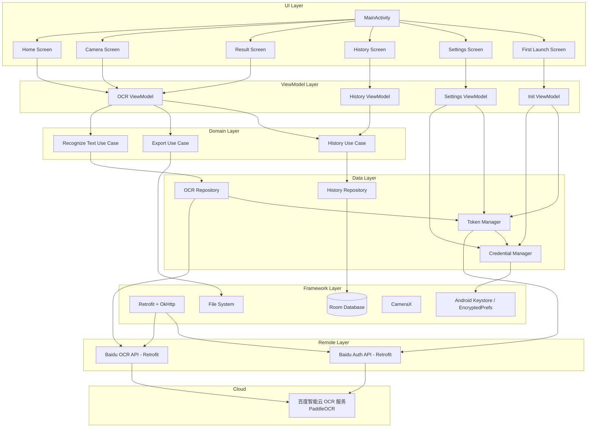
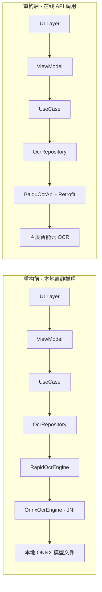

# PaddleOCR 在线 API 重构设计

Feature Name: paddleocr-online-api
Updated: 2026-07-13

## 描述

将 Android OCR 应用的识别引擎从本地 RapidOCR ONNX Runtime 推理迁移至百度智能云 OCR 在线 API（基于 PaddleOCR 技术）。移除 JNI/C++ 原生层和本地模型文件，改为纯 Kotlin HTTP 网络调用。复用现有 UI 层（首页/结果页/历史页/设置页），针对在线 API 特性进行适配优化（网络状态提示、重试机制、凭证配置）。

### 重构范围

| 模块 | 操作 | 说明 |
|------|------|------|
| `data/ocr/RapidOcrEngine.kt` | 删除 | JNI 引擎封装，由网络服务替代 |
| `data/ocr/impl/OnnxOcrEngine.kt` | 删除 | ONNX 推理引擎 |
| `data/ocr/impl/ImagePreprocessor.kt` | 删除 | 本地图像预处理 |
| `data/ocr/impl/ImageUtils.kt` | 删除 | ONNX 专用图像工具 |
| `data/ocr/OcrConfig.kt` | 删除 | ONNX 模型配置 |
| `data/local/model/ModelManager.kt` | 删除 | 本地模型文件管理 |
| `util/OnnxModelHelper.kt` | 删除 | ONNX 模型辅助工具 |
| `assets/models/` | 删除 | 打包的 ONNX 模型文件 |
| NDK/CMake 配置 | 删除 | `build.gradle.kts` 中移除 |
| `data/remote/` | 新增 | 网络层：API 接口、Token 管理、凭证管理 |
| `OcrRepository.kt` | 修改 | 从调用本地引擎改为调用远程 API |
| `Models.kt` | 修改 | ModelType 改为 OcrMode |
| `SettingsViewModel.kt` | 修改 | 模型切换改为识别模式切换 + 凭证管理 |
| `SettingsScreen.kt` | 修改 | 增加凭证配置入口和测试连接功能 |
| `FirstLaunchScreen.kt` | 修改 | 引导用户配置 API 凭证 |
| `app/build.gradle.kts` | 修改 | 移除 ONNX/NDK，新增 Retrofit/OkHttp |
| UI 层（首页/结果页/历史页） | 复用 | 保留现有交互逻辑 |

## 架构

### 系统架构图



### 重构前后架构对比



### 模块划分（重构后）

```
com.rapidocr.app/
├── ui/                          # UI 层 (Jetpack Compose) - 复用
│   ├── theme/                   # Material3 主题
│   ├── home/                    # 首页（拍照/选图入口）
│   ├── camera/                  # 相机页
│   ├── result/                  # 识别结果页（编辑/查看/导出）
│   ├── history/                 # 历史记录页
│   ├── settings/                # 设置页（识别模式 + 凭证配置）
│   ├── setup/                   # 首次启动引导页（凭证配置）
│   ├── navigation/              # 导航
│   └── components/              # 共享 UI 组件
├── viewmodel/                   # ViewModel 层 - 复用+适配
│   ├── OcrViewModel.kt
│   ├── HistoryViewModel.kt
│   ├── SettingsViewModel.kt
│   └── InitializationViewModel.kt
├── domain/                      # 领域层 - 复用+适配
│   ├── usecase/
│   │   ├── RecognizeTextUseCase.kt
│   │   ├── ExportResultUseCase.kt
│   │   └── HistoryUseCase.kt
│   └── model/
│       ├── Models.kt            # 修改: ModelType → OcrMode
│       └── OcrResult.kt
├── data/                        # 数据层
│   ├── repository/
│   │   ├── OcrRepository.kt     # 修改: 调用远程 API
│   │   └── HistoryRepository.kt
│   ├── remote/                  # 新增: 网络层
│   │   ├── BaiduOcrApi.kt       # Retrofit OCR 接口定义
│   │   ├── BaiduAuthApi.kt      # Retrofit 认证接口定义
│   │   ├── BaiduOcrService.kt   # OCR 服务实现
│   │   ├── TokenManager.kt      # access_token 管理
│   │   ├── CredentialManager.kt # API 凭证加密存储
│   │   ├── NetworkModule.kt     # 网络依赖注入
│   │   └── dto/                 # 数据传输对象
│   │       ├── OcrRequestDto.kt
│   │       ├── OcrResponseDto.kt
│   │       └── TokenResponseDto.kt
│   ├── local/
│   │   ├── database/
│   │   │   ├── AppDatabase.kt
│   │   │   └── HistoryDao.kt
│   │   └── entity/
│   │       └── HistoryEntity.kt
│   └── util/
│       └── ImageEncoder.kt      # 新增: Bitmap 转 Base64 + 压缩
├── di/                          # 依赖注入 (Hilt)
│   ├── AppModule.kt             # 修改: 移除 ModelManager
│   ├── NetworkModule.kt         # 新增: Retrofit/OkHttp
│   └── ViewModelModule.kt       # 修改: 更新依赖
└── MainActivity.kt
```

## 组件和接口

### 1. BaiduOcrApi (Retrofit OCR 接口)

定义百度智能云 OCR 的 HTTP 接口。

```kotlin
interface BaiduOcrApi {
    @FormUrlEncoded
    @POST("rest/2.0/ocr/v1/general_basic")
    suspend fun recognizeGeneralBasic(
        @Query("access_token") token: String,
        @Field("image") imageBase64: String,
        @Field("language_type") language: String = "CHN_ENG"
    ): OcrResponseDto

    @FormUrlEncoded
    @POST("rest/2.0/ocr/v1/accurate_basic")
    suspend fun recognizeAccurateBasic(
        @Query("access_token") token: String,
        @Field("image") imageBase64: String,
        @Field("language_type") language: String = "CHN_ENG"
    ): OcrResponseDto

    @FormUrlEncoded
    @POST("rest/2.0/ocr/v1/accurate")
    suspend fun recognizeAccurate(
        @Query("access_token") token: String,
        @Field("image") imageBase64: String,
        @Field("language_type") language: String = "CHN_ENG"
    ): OcrResponseWithLocationDto
}
```

### 2. BaiduAuthApi (Retrofit 认证接口)

```kotlin
interface BaiduAuthApi {
    @POST("oauth/2.0/token")
    @FormUrlEncoded
    suspend fun getAccessToken(
        @Field("grant_type") grantType: String = "client_credentials",
        @Field("client_id") apiKey: String,
        @Field("client_secret") secretKey: String
    ): TokenResponseDto
}
```

### 3. TokenManager (令牌管理)

负责 access_token 的获取、缓存和自动刷新。

```kotlin
@Singleton
class TokenManager @Inject constructor(
    private val authApi: BaiduAuthApi,
    private val credentialManager: CredentialManager,
    private val prefs: SharedPreferences
) {
    private val tokenLock = Mutex()

    suspend fun getValidToken(): Result<String>
    suspend fun refreshToken(): Result<String>
    fun isTokenValid(): Boolean
    fun clearToken()

    companion object {
        private const val KEY_ACCESS_TOKEN = "baidu_access_token"
        private const val KEY_TOKEN_EXPIRE_AT = "baidu_token_expire_at"
        private const val TOKEN_REFRESH_BUFFER_MS = 5 * 60 * 1000L  // 提前 5 分钟刷新
    }
}
```

**关键行为**：
- access_token 缓存在 SharedPreferences 中，记录过期时间戳
- 调用 `getValidToken()` 时检查剩余有效期，不足 5 分钟则自动刷新
- 使用 `Mutex` 保证并发场景下只发起一次刷新请求
- 凭证无效时返回 `Result.failure`，上层据此提示用户

### 4. CredentialManager (凭证管理)

负责 API Key 和 Secret Key 的加密存储。

```kotlin
@Singleton
class CredentialManager @Inject constructor(
    @ApplicationContext private val context: Context
) {
    private val masterKey = MasterKey.Builder(context)
        .setKeyScheme(MasterKey.KeyScheme.AES256_GCM)
        .build()

    private val encryptedPrefs = EncryptedSharedPreferences.create(
        context,
        "baidu_credential_prefs",
        masterKey,
        EncryptedSharedPreferences.PrefKeyEncryptionScheme.AES256_SIV,
        EncryptedSharedPreferences.PrefValueEncryptionScheme.AES256_GCM
    )

    fun saveCredentials(apiKey: String, secretKey: String): Boolean
    fun getApiKey(): String?
    fun getSecretKey(): String?
    fun hasCredentials(): Boolean
    fun clearCredentials()
    fun testCredentials(callback: (Boolean) -> Unit)  // 异步测试凭证有效性
}
```

**安全设计**：
- 使用 Jetpack Security 的 `EncryptedSharedPreferences` 存储凭证
- 基于 AES256-GCM 加密，主密钥存储在 Android Keystore 中
- 凭证不经过 Log 输出，不上报至任何第三方服务

### 5. BaiduOcrService (OCR 服务)

封装 OCR 调用逻辑，处理 token 获取、图片编码、响应解析。

```kotlin
@Singleton
class BaiduOcrService @Inject constructor(
    private val ocrApi: BaiduOcrApi,
    private val tokenManager: TokenManager
) {
    suspend fun recognize(bitmap: Bitmap, mode: OcrMode): Result<OcrResult> {
        return withContext(Dispatchers.IO) {
            try {
                val imageBase64 = ImageEncoder.encodeAndCompress(bitmap, maxSizeBytes = 4 * 1024 * 1024)
                val tokenResult = tokenManager.getValidToken()
                if (tokenResult.isFailure) {
                    return@withContext Result.failure(tokenResult.exceptionOrNull()!!)
                }
                val token = tokenResult.getOrThrow()

                val response = when (mode) {
                    OcrMode.STANDARD -> ocrApi.recognizeGeneralBasic(token, imageBase64)
                    OcrMode.HIGH_ACCURACY -> ocrApi.recognizeAccurateBasic(token, imageBase64)
                    OcrMode.HIGH_ACCURACY_WITH_LOCATION -> ocrApi.recognizeAccurate(token, imageBase64)
                }

                if (response.errorCode != null && response.errorCode != 0) {
                    return@withContext Result.failure(OcrApiException(response.errorCode, response.errorMessage))
                }

                Result.success(response.toDomainModel())
            } catch (e: Exception) {
                Result.failure(e)
            }
        }
    }
}
```

### 6. OcrRepository (修改后)

```kotlin
@Singleton
class OcrRepository @Inject constructor(
    private val ocrService: BaiduOcrService,
    private val credentialManager: CredentialManager
) {
    suspend fun recognize(bitmap: Bitmap, mode: OcrMode): Result<OcrResult> {
        if (!credentialManager.hasCredentials()) {
            return Result.failure(NoCredentialsException("请先配置百度智能云 API 凭证"))
        }
        return ocrService.recognize(bitmap, mode)
    }

    fun isReady(): Boolean = credentialManager.hasCredentials()

    fun getLastError(): String? = lastError
    private var lastError: String? = null
}
```

### 7. ImageEncoder (图片编码工具)

```kotlin
object ImageEncoder {
    fun encodeAndCompress(bitmap: Bitmap, maxSizeBytes: Int): String {
        var quality = 100
        var outputStream = ByteArrayOutputStream()
        bitmap.compress(Bitmap.CompressFormat.JPEG, quality, outputStream)
        var bytes = outputStream.toByteArray()

        while (bytes.size > maxSizeBytes && quality > 10) {
            quality -= 10
            outputStream = ByteArrayOutputStream()
            bitmap.compress(Bitmap.CompressFormat.JPEG, quality, outputStream)
            bytes = outputStream.toByteArray()
        }
        return Base64.encodeToString(bytes, Base64.NO_WRAP)
    }
}
```

## 数据模型

### 领域模型（修改后）

```kotlin
data class OcrResult(
    val boxes: List<TextBox>,    // 含位置模式时有值，否则为空列表
    val fullText: String,
    val elapsedMs: Long
)

data class TextBox(
    val points: List<PointF>,    // 四边形四个顶点（顺时针），含位置模式时有值
    val text: String,
    val confidence: Float        // 百度 API 部分接口不返回置信度，默认 1.0f
)

data class HistoryRecord(
    val id: Long = 0,
    val thumbnailPath: String,
    val fullText: String,
    val summary: String,
    val createdAt: Long,
    val ocrMode: String          // 新增: 记录使用的识别模式
)

data class ImageMeta(
    val width: Int,
    val height: Int,
    val format: String
)

enum class OcrMode {
    STANDARD,                     // general_basic - 标准模式，速度快
    HIGH_ACCURACY,                // accurate_basic - 高精度模式
    HIGH_ACCURACY_WITH_LOCATION   // accurate - 高精度含位置信息
}

enum class ExportFormat { TXT, PDF, MARKDOWN, JSON }
```

### DTO 数据传输对象

```kotlin
// Token 响应
data class TokenResponseDto(
    @SerializedName("access_token") val accessToken: String?,
    @SerializedName("expires_in") val expiresIn: Long?,
    @SerializedName("error") val error: String?,
    @SerializedName("error_description") val errorDescription: String?
)

// OCR 响应（不含位置）
data class OcrResponseDto(
    @SerializedName("words_result_num") val wordsResultNum: Int = 0,
    @SerializedName("words_result") val wordsResult: List<WordsItemDto>? = null,
    @SerializedName("error_code") val errorCode: Int? = null,
    @SerializedName("error_msg") val errorMessage: String? = null,
    @SerializedName("log_id") val logId: Long? = null
)

data class WordsItemDto(
    @SerializedName("words") val words: String
)

// OCR 响应（含位置）
data class OcrResponseWithLocationDto(
    @SerializedName("words_result_num") val wordsResultNum: Int = 0,
    @SerializedName("words_result") val wordsResult: List<WordsLocationItemDto>? = null,
    @SerializedName("error_code") val errorCode: Int? = null,
    @SerializedName("error_msg") val errorMessage: String? = null,
    @SerializedName("log_id") val logId: Long? = null
)

data class WordsLocationItemDto(
    @SerializedName("words") val words: String,
    @SerializedName("location") val location: LocationDto?
)

data class LocationDto(
    @SerializedName("top") val top: Int,
    @SerializedName("left") val left: Int,
    @SerializedName("width") val width: Int,
    @SerializedName("height") val height: Int
)
```

### DTO 到领域模型转换

```kotlin
fun OcrResponseDto.toDomainModel(elapsedMs: Long): OcrResult {
    val words = wordsResult?.map { it.words } ?: emptyList()
    return OcrResult(
        boxes = emptyList(),  // 不含位置模式无坐标
        fullText = words.joinToString("\n"),
        elapsedMs = elapsedMs
    )
}

fun OcrResponseWithLocationDto.toDomainModel(elapsedMs: Long): OcrResult {
    val boxes = wordsResult?.mapIndexed { index, item ->
        val loc = item.location
        TextBox(
            points = if (loc != null) listOf(
                PointF(loc.left.toFloat(), loc.top.toFloat()),
                PointF((loc.left + loc.width).toFloat(), loc.top.toFloat()),
                PointF((loc.left + loc.width).toFloat(), (loc.top + loc.height).toFloat()),
                PointF(loc.left.toFloat(), (loc.top + loc.height).toFloat())
            ) else emptyList(),
            text = item.words,
            confidence = 1.0f
        )
    } ?: emptyList()
    return OcrResult(
        boxes = boxes,
        fullText = boxes.joinToString("\n") { it.text },
        elapsedMs = elapsedMs
    )
}
```

### 数据库实体 (Room - 修改后)

```kotlin
@Entity(tableName = "history")
data class HistoryEntity(
    @PrimaryKey(autoGenerate = true) val id: Long = 0,
    val thumbnailPath: String,
    val fullText: String,
    val summary: String,
    val createdAt: Long,
    val ocrMode: String = OcrMode.STANDARD.name  // 新增字段
)
```

## 百度智能云 OCR API 规范

### 认证流程

```
1. 用户在百度智能云控制台创建应用，获取 API Key + Secret Key
2. 应用调用 https://aip.baidubce.com/oauth/2.0/token 获取 access_token
   - POST, application/x-www-form-urlencoded
   - 参数: grant_type=client_credentials, client_id={API Key}, client_secret={Secret Key}
   - 返回: { access_token, expires_in, ... }
   - access_token 有效期 30 天 (2592000 秒)
3. 应用使用 access_token 调用 OCR 接口
```

### OCR 接口对比

| 接口 | 端点 | 精度 | 位置信息 | 免费额度 |
|------|------|------|---------|---------|
| 标准版 | `rest/2.0/ocr/v1/general_basic` | 标准 | 无 | 50000 次/天 |
| 高精度版 | `rest/2.0/ocr/v1/accurate_basic` | 高 | 无 | 500 次/天 |
| 高精度含位置 | `rest/2.0/ocr/v1/accurate` | 高 | 有 | 500 次/天 |

### 请求格式

```
POST https://aip.baidubce.com/rest/2.0/ocr/v1/{endpoint}?access_token={token}
Content-Type: application/x-www-form-urlencoded

image={base64编码图片}&language_type=CHN_ENG
```

### 响应格式（不含位置）

```json
{
  "words_result_num": 2,
  "words_result": [
    { "words": "正品促销" },
    { "words": "大桶装更划算" }
  ],
  "log_id": 1234567890
}
```

### 响应格式（含位置）

```json
{
  "words_result_num": 2,
  "words_result": [
    {
      "words": "正品促销",
      "location": { "top": 2, "left": 6, "width": 316, "height": 102 }
    }
  ],
  "log_id": 1234567890
}
```

### 错误响应

```json
{
  "error_code": 110,
  "error_msg": "Access token invalid",
  "log_id": 1234567890
}
```

### 常见错误码处理

| error_code | 含义 | 处理方式 |
|-----------|------|---------|
| 110 | access_token 失效 | 自动刷新 token 后重试一次 |
| 111 | access_token 过期 | 自动刷新 token 后重试一次 |
| 18 | QPS 超限 | 延迟 500ms 后重试 |
| 17 | 配额用完 | 提示用户"今日免费额度已用完" |
| 216201 | 图片格式错误 | 提示"图片格式不支持" |
| 216202 | 图片大小超限 | 自动压缩后重试 |

## 正确性属性

1. **凭证加密存储** — API Key 和 Secret Key SHALL 使用 EncryptedSharedPreferences 存储，明文不出现在内存日志中
2. **Token 并发安全** — 多个并发识别请求触发 token 刷新时 SHALL 只发起一次刷新请求（Mutex 保证）
3. **Token 自动刷新** — access_token 剩余有效期不足 5 分钟时 SHALL 自动刷新
4. **Token 失效重试** — OCR 调用返回 token 失效错误（code 110/111）时 SHALL 刷新 token 后重试一次
5. **线程安全** — 网络请求 SHALL 在 IO 线程执行，禁止在主线程发起网络调用
6. **资源释放** — Activity/Fragment 销毁时 SHALL 释放 Bitmap 资源
7. **数据一致性** — 历史记录删除操作 SHALL 同时删除对应的缩略图文件
8. **图片大小限制** — 上传图片经压缩后 SHALL 不超过 4MB（百度 API 限制）
9. **网络超时** — 网络请求 SHALL 设置 15 秒连接超时和 30 秒读取超时

## 错误处理

| 错误场景 | 处理方式 |
|---------|---------|
| 相机权限被拒绝 | 显示权限申请引导，提供跳转系统设置入口 |
| 网络不可用 | 提示"网络不可用，请检查网络连接"，禁用识别按钮 |
| API 凭证未配置 | 引导用户进入设置页配置凭证 |
| access_token 获取失败 | 提示"API 凭证无效，请检查后重新配置" |
| access_token 失效（code 110/111） | 自动刷新 token 后重试一次，仍失败则提示重新配置凭证 |
| QPS 超限（code 18） | 延迟 500ms 后重试，最多重试 2 次 |
| 免费额度用完（code 17） | 提示"今日免费额度已用完，请明日再试" |
| 图片格式错误（code 216201） | 提示"图片格式不支持" |
| 图片过大（code 216202） | 自动压缩后重试 |
| 网络请求超时 | 提示"请求超时，请检查网络后重试" |
| OCR 服务端错误 | 提示"识别服务暂时不可用，请稍后重试" |
| 图片过大导致 OOM | 捕获后自动压缩至最大 4096px 边长再重试 |
| 存储空间不足 | 导出时检测，提示用户清理空间后重试 |
| 历史记录数据库异常 | 捕获为 Flow 错误，UI 展示空状态页 |

## 测试策略

### 单元测试

- `CredentialManager` — 验证凭证加密存储、读取、清除逻辑
- `TokenManager` — 模拟 BaiduAuthApi，验证 token 缓存、过期刷新、并发刷新（Mutex）
- `BaiduOcrService` — 模拟 BaiduOcrApi 和 TokenManager，验证各模式调用、错误码处理、重试逻辑
- `OcrRepository` — 模拟 BaiduOcrService，验证凭证检查、成功/失败路径
- `ImageEncoder` — 验证图片压缩至目标大小、Base64 编码正确性
- `ExportResultUseCase` — 验证 TXT/PDF/Markdown/JSON 文件生成正确性
- `HistoryRepository` — 验证 Room DAO CRUD 操作

### 集成测试

- 端到端 OCR 流程：测试图片 → Base64 编码 → API 调用（MockWebServer）→ 响应解析 → UI 展示
- Token 刷新流程：过期 token → 自动刷新 → 重试 OCR 调用
- 凭证配置流程：首次启动 → 引导配置 → 测试连接 → 识别成功
- 识别模式切换：STANDARD → HIGH_ACCURACY → HIGH_ACCURACY_WITH_LOCATION 切换后验证调用正确接口
- 历史记录：识别 → 保存 → 查询 → 删除完整链路

### UI 测试 (Compose Test)

- 首页按钮交互验证
- 结果页编辑/复制/分享操作
- 设置页凭证输入、保存、测试连接
- 首次启动引导页流程
- 历史记录列表展示和滑动删除

### 性能测试

- 良好网络下单次识别总耗时 SHALL < 5 秒
- 图片压缩耗时 SHALL < 500ms（5M 图片）
- 连续识别 10 张图片无内存泄漏

## 依赖配置（修改后）

```kotlin
dependencies {
    // Core - 保留
    implementation("androidx.core:core-ktx:1.12.0")
    implementation("androidx.lifecycle:lifecycle-runtime-ktx:2.7.0")
    implementation("androidx.lifecycle:lifecycle-viewmodel-compose:2.7.0")
    implementation("androidx.activity:activity-compose:1.8.2")

    // Compose - 保留
    implementation(platform("androidx.compose:compose-bom:2024.02.00"))
    implementation("androidx.compose.ui:ui")
    implementation("androidx.compose.ui:ui-graphics")
    implementation("androidx.compose.ui:ui-tooling-preview")
    implementation("androidx.compose.material3:material3")
    implementation("androidx.compose.material:material-icons-extended")
    implementation("androidx.navigation:navigation-compose:2.7.7")

    // CameraX - 保留
    implementation("androidx.camera:camera-camera2:1.3.1")
    implementation("androidx.camera:camera-lifecycle:1.3.1")
    implementation("androidx.camera:camera-view:1.3.1")

    // Room - 保留
    implementation("androidx.room:room-runtime:2.6.1")
    implementation("androidx.room:room-ktx:2.6.1")
    kapt("androidx.room:room-compiler:2.6.1")

    // Hilt - 保留
    implementation("com.google.dagger:hilt-android:2.50")
    kapt("com.google.dagger:hilt-compiler:2.50")
    implementation("androidx.hilt:hilt-navigation-compose:1.2.0")

    // --- 新增: 网络层 ---
    // Retrofit
    implementation("com.squareup.retrofit2:retrofit:2.9.0")
    implementation("com.squareup.retrofit2:converter-gson:2.9.0")
    // OkHttp
    implementation("com.squareup.okhttp3:okhttp:4.12.0")
    implementation("com.squareup.okhttp3:logging-interceptor:4.12.0")
    // Gson
    implementation("com.google.code.gson:gson:2.10.1")

    // --- 新增: 安全存储 ---
    // EncryptedSharedPreferences
    implementation("androidx.security:security-crypto:1.1.0-alpha06")

    // --- 移除 ---
    // com.microsoft.onnxruntime:onnxruntime-android  -- 已移除

    // iText PDF - 保留
    implementation("com.itextpdf:itext7-core:7.2.5")

    // Coroutines - 保留
    implementation("org.jetbrains.kotlinx:kotlinx-coroutines-android:1.7.3")

    // Image processing - 保留
    implementation("androidx.exifinterface:exifinterface:1.3.7")

    // Testing - 保留 + 新增
    testImplementation(kotlin("test"))
    testImplementation("junit:junit:4.13.2")
    testImplementation("org.jetbrains.kotlinx:kotlinx-coroutines-test:1.7.3")
    testImplementation("io.mockk:mockk:1.13.9")
    testImplementation("app.cash.turbine:turbine:1.0.0")
    testImplementation("com.squareup.okhttp3:mockwebserver:4.12.0")  // 新增
    androidTestImplementation("androidx.test.ext:junit:1.1.5")
    androidTestImplementation("androidx.test.espresso:espresso-core:3.5.1")
    androidTestImplementation(platform("androidx.compose:compose-bom:2024.02.00"))
    androidTestImplementation("androidx.compose.ui:ui-test-junit4")
    androidTestImplementation("androidx.room:room-testing:2.6.1")
    debugImplementation("androidx.compose.ui:ui-tooling")
    debugImplementation("androidx.compose.ui:ui-test-manifest")
}
```

## 构建配置（修改后）

### 基础配置 - 移除 NDK

```kotlin
android {
    namespace = "com.rapidocr.app"
    compileSdk = 34
    buildToolsVersion = "34.0.0"
    // 移除: ndkVersion = "25.2.9519653"

    defaultConfig {
        applicationId = "com.rapidocr.app"
        minSdk = 26
        targetSdk = 34
        versionCode = 2          // 版本号递增
        versionName = "2.0"      // 重构大版本
        testInstrumentationRunner = "androidx.test.runner.AndroidJUnitRunner"
        vectorDrawables {
            useSupportLibrary = true
        }
        // 移除: ndk { abiFilters ... }
        // 移除: externalNativeBuild { cmake { ... } }
    }

    // 移除: externalNativeBuild { cmake { path ... } }

    // 其余配置保留
    buildTypes { ... }
    compileOptions { ... }
    kotlinOptions { ... }
    buildFeatures { compose = true }
    composeOptions { kotlinCompilerExtensionVersion = "1.5.10" }
    packaging { ... }
}
```

### 移除项

| 移除项 | 原因 |
|-------|------|
| `ndkVersion` | 不再需要原生库 |
| `externalNativeBuild { cmake { ... } }` | 不再编译 C++ 代码 |
| `ndk { abiFilters ... }` | 不再有 .so 产物 |
| `assets/models/` 目录 | 不再打包 ONNX 模型文件 |
| `src/main/cpp/` 目录 | 不再有 C++ 源码 |

## 网络安全配置

### AndroidManifest.xml 新增

```xml
<uses-permission android:name="android.permission.INTERNET" />
<uses-permission android:name="android.permission.ACCESS_NETWORK_STATE" />
```

### 网络安全配置文件 `res/xml/network_security_config.xml`

```xml
<?xml version="1.0" encoding="utf-8"?>
<network-security-config>
    <base-config cleartextTrafficPermitted="false">
        <trust-anchors>
            <certificates src="system" />
        </trust-anchors>
    </base-config>
    <domain-config cleartextTrafficPermitted="false">
        <domain includeSubdomains="true">aip.baidubce.com</domain>
    </domain-config>
</network-security-config>
```

## 参考

[^1]: (Website) - [百度智能云 OCR 文字识别文档](https://ai.baidu.com/ai-doc/OCR/index)
[^2]: (Website) - [百度智能云 通用文字识别 API 文档](https://ai.baidu.com/ai-doc/OCR/1k3h7y3ia)
[^3]: (Website) - [百度智能云 获取 access_token 文档](https://ai.baidu.com/ai-doc/REFERENCE/Ck3dwjhhu)
[^4]: (Website) - [PaddleOCR 官方文档](https://paddlepaddle.github.io/PaddleOCR/)
[^5]: (GitHub) - [PaddleOCR 仓库](https://github.com/PaddlePaddle/PaddleOCR) - 百度飞桨 OCR 开源项目
[^6]: (Android Docs) - [EncryptedSharedPreferences](https://developer.android.com/reference/androidx/security/crypto/EncryptedSharedPreferences)
[^7]: (GitHub) - [Retrofit](https://github.com/square/retrofit) - HTTP 客户端
